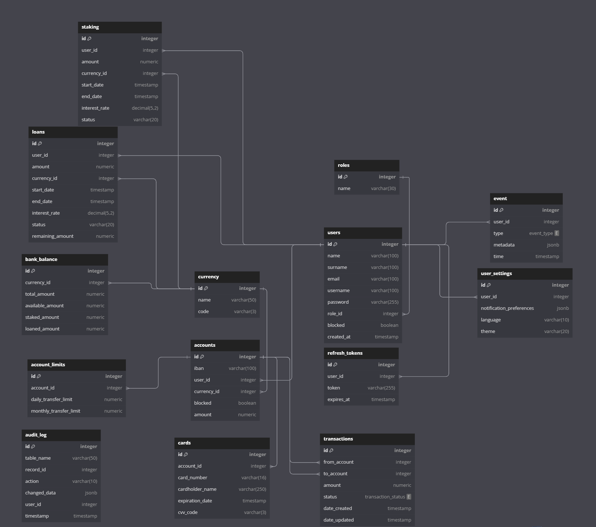

# Custom Banking API

## New Features

### Card Transfers API
Allows users to transfer money between cards.

- **POST /api/v1/cards/transfer** - Transfer money from one card to another
- **GET /api/v1/cards/info/:number** - Get card information by card number
- **GET /api/v1/cards/transaction/:id** - Get transaction details
- **GET /api/v1/cards/:id/transactions** - List card transactions
- **GET /api/v1/cards/user/:user_id** - List user's cards

### Loans API
Provides functionality for loan management.

- **POST /api/v1/loans** - Create a new loan application
- **GET /api/v1/loans/:id** - Get loan by ID
- **GET /api/v1/loans/user/:user_id** - Get user's loans
- **GET /api/v1/loans** - List loans with filtering and pagination
- **PATCH /api/v1/loans/:id/status** - Update loan status
- **POST /api/v1/loans/:id/payments** - Make a loan payment
- **GET /api/v1/loans/:id/payments** - Get loan payment history

### Staking API
Enables users to stake funds and earn interest.

- **POST /api/v1/staking** - Create a new staking deposit
- **GET /api/v1/staking/:id** - Get staking by ID
- **GET /api/v1/staking/user/:user_id** - Get user's stakings
- **GET /api/v1/staking** - List stakings with filtering and pagination
- **POST /api/v1/staking/:id/withdraw** - Withdraw funds from staking
- **GET /api/v1/staking/:id/interest** - Get earned interest for a staking
- **GET /api/v1/staking/:id/interests** - Get interest payment history
- **POST /api/v1/staking/calculate** - Calculate projected interest

## API Documentation

### Card Transfers API

#### Transfer Between Cards
```
POST /api/v1/cards/transfer
```
Request body:
```json
{
  "from_card_number": "1234567890123456",
  "to_card_number": "6543210987654321",
  "amount": 100.00,
  "description": "Payment for services"
}
```

### Loans API

#### Create Loan
```
POST /api/v1/loans
```
Request body:
```json
{
  "user_id": 1,
  "amount": 5000.00,
  "currency_id": 1,
  "months_duration": 12,
  "interest_rate": 10.0
}
```

#### Make Loan Payment
```
POST /api/v1/loans/:id/payments
```
Request body:
```json
{
  "loan_id": 1,
  "amount": 500.00,
  "account_id": 1,
  "payment_method": "account_transfer"
}
```

### Staking API

#### Create Staking
```
POST /api/v1/staking
```
Request body:
```json
{
  "user_id": 1,
  "amount": 1000.00,
  "currency_id": 1,
  "duration_days": 90,
  "account_id": 1
}
```

#### Withdraw Staking
```
POST /api/v1/staking/:id/withdraw
```
Request body:
```json
{
  "staking_id": 1,
  "account_id": 1
}
```

#### Calculate Projected Interest
```
POST /api/v1/staking/calculate
```
Request body:
```json
{
  "amount": 1000.00,
  "days": 90,
  "interest_rate": 5.0
}
```

## Interest Rates for Staking
- 1-30 days: 3%
- 31-90 days: 5%
- 91-180 days: 7%
- 180+ days: 10%

## Loan Statuses
- **pending** - Loan application is pending approval
- **approved** - Loan has been approved
- **active** - Loan is currently active and being used
- **rejected** - Loan application has been rejected
- **repaid** - Loan has been fully repaid
- **overdue** - Loan payment is overdue
- **cancelled** - Loan has been cancelled

## Staking Statuses
- **pending** - Staking deposit is pending confirmation
- **active** - Staking is active and earning interest
- **matured** - Staking period has ended, ready for withdrawal
- **withdrawn** - Funds have been withdrawn
- **cancelled** - Staking has been cancelled early with partial interest

## Loan Features
- Multiple loan statuses as listed above
- Ability to make partial payments
- Tracking of payment history
- Automatic updating of remaining loan amount

## Card Transfer Features
- Real-time balance updates
- Transaction history
- Card information masking for security (e.g., **** **** **** 1234)
- Validation of sufficient funds and card status


